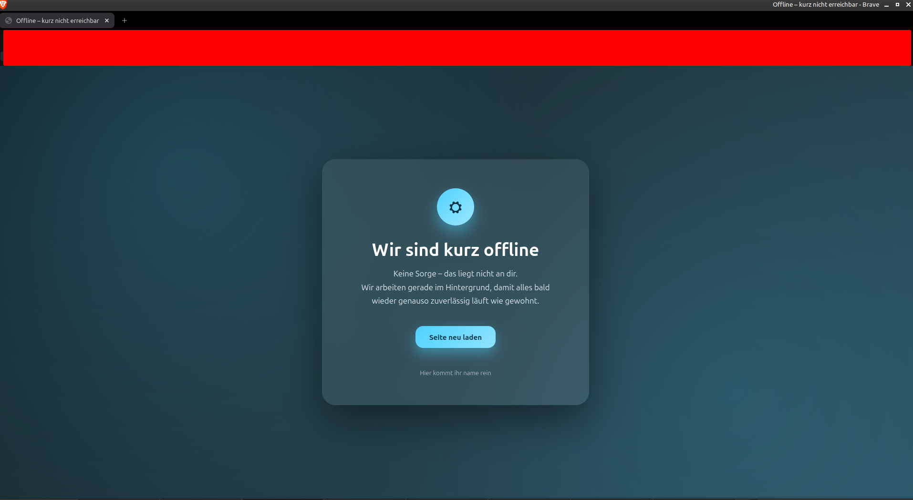

---

# 🌙 Offline‑Website Template – HTML & CSS

Ein modernes, ruhiges und **menschliches Offline‑ bzw. Wartungsseiten‑Template**  
erstellt mit **reinem HTML & CSS** – ohne Frameworks, ohne Abhängigkeiten.

Ideal, um Besucher freundlich aufzufangen, wenn eine Website gerade
kurz nicht erreichbar ist.

---

## ❤️ Warum dieses Template?

Niemand mag technische Fehlermeldungen oder kalte „404“-Seiten.  
Dieses Template sagt stattdessen:

> „Alles gut. Du hast nichts falsch gemacht.  
> Wir kümmern uns darum und sind gleich wieder da.“

Ruhig, ehrlich und professionell.

---

## 📸 Vorschau

---

## 🚀 Features

* Modernes, professionelles Design
* Menschliche, beruhigende Texte
* Animierter Hintergrund mit sanften Effekten
* Glass‑Design (Blur / Glassmorphism)
* Komplett offlinefähig
* Responsiv (Mobil & Desktop)
* Perfekt für GitHub Pages

---

## 🛠️ Technologien

* HTML5
* CSS3  
*(alles in einer Datei, kein JavaScript nötig)*

---
## ✅ So benutzt du es

### Lokal
1. Dateien herunterladen
2. `index.html` im Browser öffnen
3. Fertig ✅

### Mit GitHub Pages
1. Repository erstellen
2. `index.html` ins Root‑Verzeichnis legen
3. **Settings → Pages**
4. Branch: `main` / Root
5. Seite ist online ✅

---

## 🎨 Anpassen

Du kannst alles ganz einfach ändern:

- Texte → direkt im HTML
- Farben → im CSS‑Bereich `:root`
- Icon → Emoji oder eigenes Logo
- Effekte → CSS‑Animationen

Kein Setup. Kein Build. Einfach bearbeiten.

---

## 📧 Support

**Fragen oder Probleme?**

discord DM | @junixcodingfx

🌐Discord | https://discord.gg/RJt7EUACab

---

## 📄 Lizenz

Frei nutzbar für private und kommerzielle Projekte.  
Empfohlen: **MIT‑Lizenz**

---

Danke, dass du das Template nutzt 👋  
